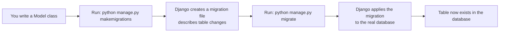

# What is a Model, and how does it work with the database?

# What is a Model, and how does it work with the database?

## 1. Big Picture

In Django, a **model** is how your Python code talks to the database. Instead of writing raw SQL (like `SELECT * FROM orders WHERE ...`), you write a Python class, and Django translates it into database operations for you.

## 2. Simple Definition

A **model** is a Python class that represents a single table in your database. Each **attribute** on the class represents a **column** in that table.

## 3. Real-World Analogy

Think of a model like a **blueprint for a form**. Imagine a paper form for "Student Registration" with boxes for Name, Age, and Grade. The blueprint (the model) defines what boxes exist and what kind of data goes in each box (text, number, date). Every time someone fills out the form, that's one **row** in the database — one actual student's data.

## 4. Django Example

Here's a small model from an example app in this repo (`examples/heavyaura-shop/orders/models.py` pattern — I'll use a simplified version):

```python
from django.db import models

class Order(models.Model):
    product_name = models.CharField(max_length=100)
    quantity = models.IntegerField(default=1)
    created_at = models.DateTimeField(auto_now_add=True)
```

## 5. Code Breakdown

- `class Order(models.Model)`: This makes `Order` a Django model. Inheriting from `models.Model` gives your class database superpowers — saving, querying, updating, deleting.
- `product_name = models.CharField(max_length=100)`: This becomes a text column in the database, limited to 100 characters.
- `quantity = models.IntegerField(default=1)`: This becomes a whole-number column, defaulting to 1 if not set.
- `created_at = models.DateTimeField(auto_now_add=True)`: This becomes a timestamp column, automatically filled in the moment an order is created.

## 6. How It Connects to the Database

Here's the key part — **how a model actually becomes a real database table**:



1. You write the `Order` model.
2. You run `makemigrations` — Django looks at your model and writes a "migration" file, which is like an instruction sheet: *"create a table called orders_order with these columns."*
3. You run `migrate` — Django reads that instruction sheet and actually creates (or updates) the table in the database (SQLite, PostgreSQL, MySQL, etc.).

Once the table exists, you interact with it using Python instead of SQL, through Django's **ORM** (Object-Relational Mapper):

```python
# Create and save a new row
Order.objects.create(product_name='T-Shirt', quantity=2)

# Read rows
Order.objects.all()                  # get every order
Order.objects.filter(quantity__gt=1)  # get orders with more than 1 item

# Update a row
order = Order.objects.get(id=1)
order.quantity = 5
order.save()

# Delete a row
order.delete()
```

Behind the scenes, Django converts each of these Python calls into the equivalent SQL statement (`INSERT`, `SELECT`, `UPDATE`, `DELETE`) for you.

## 7. Django Connection (MVT Architecture)

A model is the **M** in Django's MVT (Model-View-Template) pattern:

- **Model** → defines and manages the data (this is what we just covered).
- **View** → contains the logic that fetches data from models and decides what to send back.
- **Template** → displays that data as HTML for the user.

So a typical flow is: a **View** asks a **Model** for data → the **Model** talks to the database → the View passes that data to a **Template** to render on the page.

## 8. Why This Approach Is Used

- **No raw SQL needed** — safer and faster to write.
- **Database-agnostic** — the same model code works whether you're using SQLite, PostgreSQL, or MySQL. Django handles the differences.
- **Automatic protection against SQL injection**, since the ORM builds queries safely instead of concatenating raw strings.

## 9. Best Practices

- Always run `makemigrations` and `migrate` after changing a model — otherwise the database won't match your Python code.
- Use meaningful field types (`CharField`, `IntegerField`, `DateTimeField`, etc.) that match the real kind of data.
- Never write raw SQL with string formatting for user input — let the ORM protect you from SQL injection.
- Keep business logic that only concerns data (like validation) close to the model when possible, following Django's "fat models, thin views" convention.

## 10. Common Mistakes (Beginner Watch-Outs)

- Forgetting to run migrations after editing a model — the code will run, but the database table won't match, causing errors.
- Confusing a **model instance** (one row, e.g. `order`) with the **model class** (the table itself, e.g. `Order`).

---

**Try this to check your understanding:** Look at [examples/heavyaura-shop/orders/models.py](examples/heavyaura-shop/orders/models.py) — can you identify which fields would become which kind of database columns? Feel free to ask if any field type is unclear!
