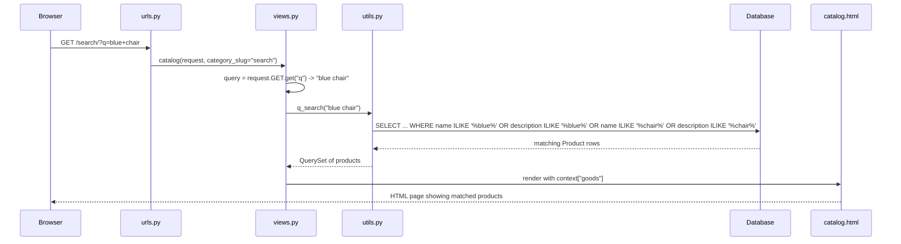

#learning 
# q_search Catalog Search Flow

## Big Picture

This code powers the **search box** on your website. When a visitor types something (like "chair" or a product ID) and hits submit, Django needs to find all `Product` rows in the database that match. `q_search()` in `utils.py` builds that database query, and `catalog()` in `views.py` calls it when it detects the user submitted a search term.

## Code Breakdown

### `utils.py` — `q_search(query)`

```python
def q_search(query):
    if query.isdigit() and len(query) <= 5:
        return Product.objects.filter(id=int(query))
```
- **Shortcut for ID lookup**: if the whole search string is digits (e.g. `"42"`) and it's 5 characters or fewer, assume the user typed a product ID and fetch that exact product. `isdigit()` checks it's all numbers; the length cap avoids treating something like a huge barcode number as an ID.

```python
    keywords = [word for word in query.split() if len(word) > 2]
```
- Otherwise, treat it as a text search. `query.split()` breaks the sentence into words on whitespace (e.g. `"blue office chair"` → `["blue", "office", "chair"]`). Words with 2 letters or fewer are dropped — short words like "a", "to", "in" are usually noise that would match too many irrelevant products.

```python
    q_objs = Q()

    for token in keywords:
        q_objs |= Q(description__icontains=token)
        q_objs |= Q(name__icontains=token)

    return Product.objects.filter(q_objs)
```
- `Q()` is Django's tool for building **complex WHERE clauses** — normal keyword filters (`filter(name="x")`) can only be ANDed together, but `Q` objects let you combine conditions with `|` (OR) and `&` (AND).
- `Q(description__icontains=token)` means "description contains this word, case-insensitive." `icontains` is the Django ORM lookup for a case-insensitive `LIKE '%token%'` SQL clause.
- The loop ORs together a check against `name` and `description` for **every keyword**, so the final `q_objs` reads like: *"name or description contains 'blue', OR name or description contains 'office', OR name or description contains 'chair'."*
- `Product.objects.filter(q_objs)` runs that combined condition as one SQL query and returns a `QuerySet` (a lazy, not-yet-executed list of matching products).

## Django Connection

This spans three MVT layers:

1. **Template** (`catalog.html`) — the filter `<form>` submits via GET, and elsewhere on the site there's presumably a search input that also submits `?q=...` to the `catalog:search` URL (you can see the form action already switches to `` whenever `request.GET.q` exists, so filters keep working alongside a search).
2. **URL** (`urls.py`) — `path("search/", views.catalog, name="search")` routes `/search/?q=...` to the exact same `catalog` view used for normal category browsing.
3. **View** (`views.py`):
   ```python
   query = request.GET.get("q", None)

   if category_slug == "all":
       goods = Product.objects.all()
   elif query:
       goods = q_search(query)
   else:
       goods = get_list_or_404(Product.objects.filter(category__slug=category_slug))
   ```
   `request.GET.get("q", None)` reads the `q` parameter from the URL's query string (e.g. `?q=blue+chair` → `"blue chair"`). If it's present, the view delegates to `q_search()` instead of filtering by category. The result (`goods`) then flows through the same on-sale filter, ordering, and pagination as any other catalog page, and gets passed into the `context` dict as `"goods"`.
4. **Model** (`models.py`) — `Product.objects` is the manager that `q_search` and the view both query against; `name` and `description` are the actual `CharField`/`TextField` columns being searched.

## Full Request Flow (search example)



## Why This Approach Is Used

- **`Q` objects** are necessary here because the number of keywords is dynamic — you can't hardcode `filter(name__icontains=a) | filter(name__icontains=b)` when you don't know in advance how many words the user typed. Building the query in a loop is the standard Django pattern for "search across multiple fields with multiple terms."
- **Reusing the same `catalog` view** for both browsing and searching avoids duplicating pagination/sorting/filtering logic.

## Best Practices / Notes

- ✅ `icontains` is safe from SQL injection — Django's ORM always parameterizes the value, so raw user input in `token` can't break out of the query.
- ⚠️ Every keyword adds two more OR conditions (`name` + `description`), so a very long search phrase could produce a slow query on large tables — for production-scale search, Postgres full-text search or a search engine (e.g. Elasticsearch) would scale better.
- ⚠️ `query.isdigit()` assumes non-negative integer IDs only — that's fine for this use case since Django's default `id` is a positive auto-increment field.
